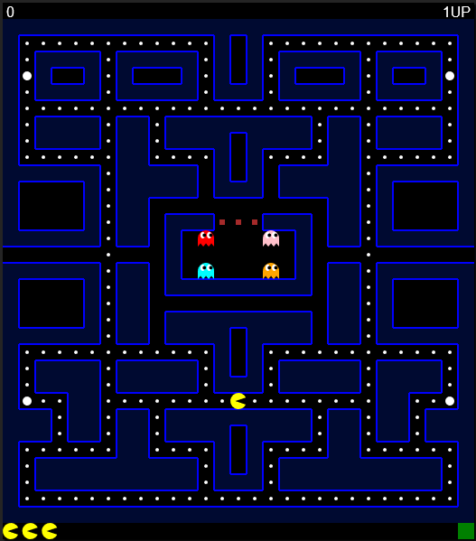

# Pac-Man

A recreation of the famous game Pac-Man using HTML5/Javascript canvas.

[Click here to play.](https://jamesscn.github.io/pacman/)

The current version of this adaptation supports the use of external devices, such as gamepads and joysticks. In order to add custom controls, they must be set from within the settings menu. The final version of this game will include a working level editor. I am also planning on making a desktop application with the game once it is finished, which will allow users to store their personal highscores.

Other features that have currently not been implemented are sound effects, music, being able to potentially resize the game and icons for the fruit. Performance optimizations will also be one of the things I will try to implement in a later update. For now, the game is just about playable.

## Background

I had originally started to write this project in Java but never completed it due to the fact that applets were no longer being used, so instead I rewrote everything from scratch in Javascript with the help of the HTML5 Canvas element. I took advantage of this opportunity to learn more about canvases and game development, with the hope of improving my programming skills.